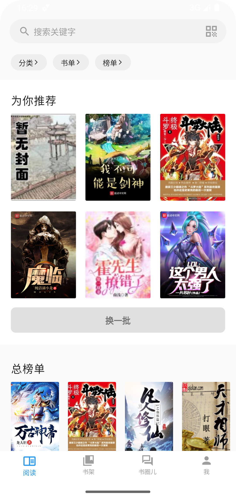
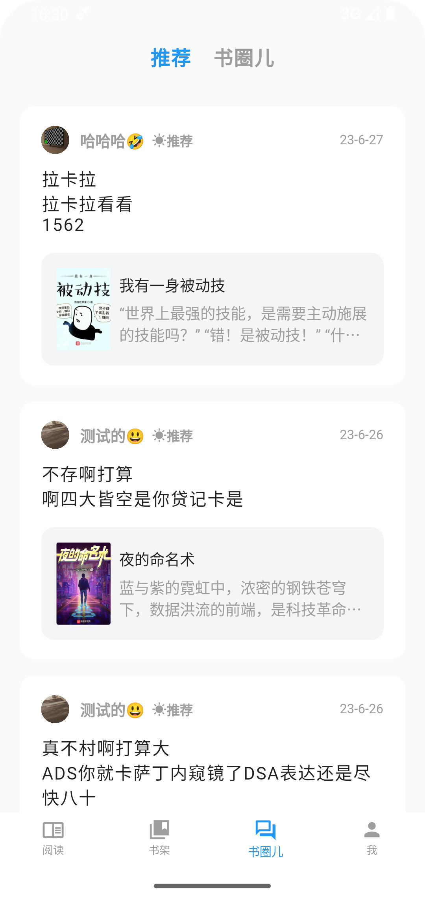
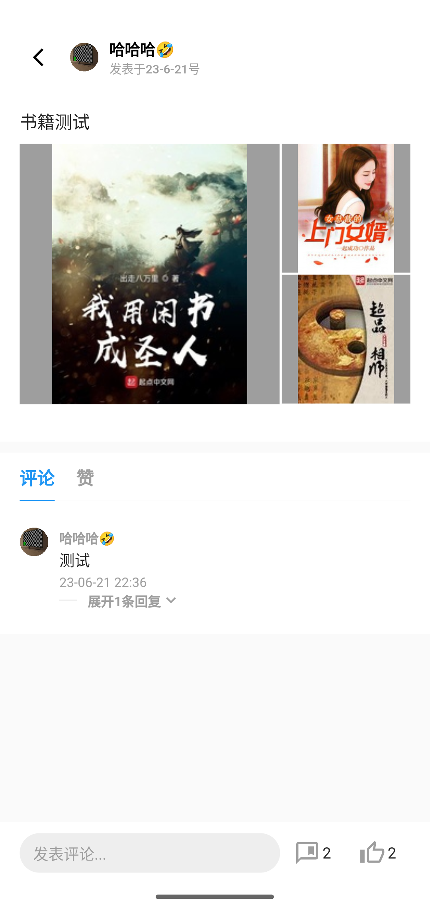
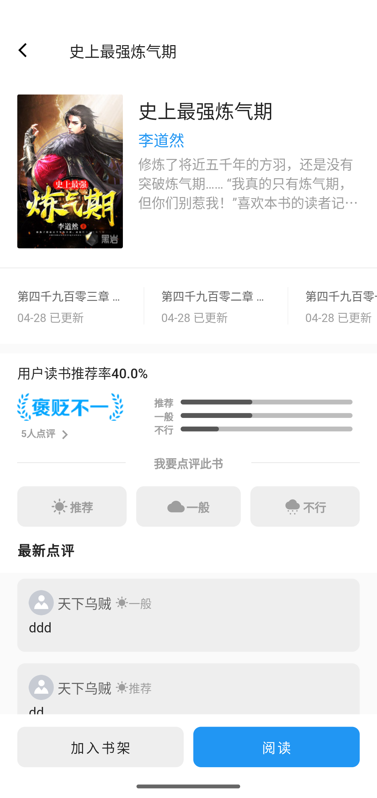
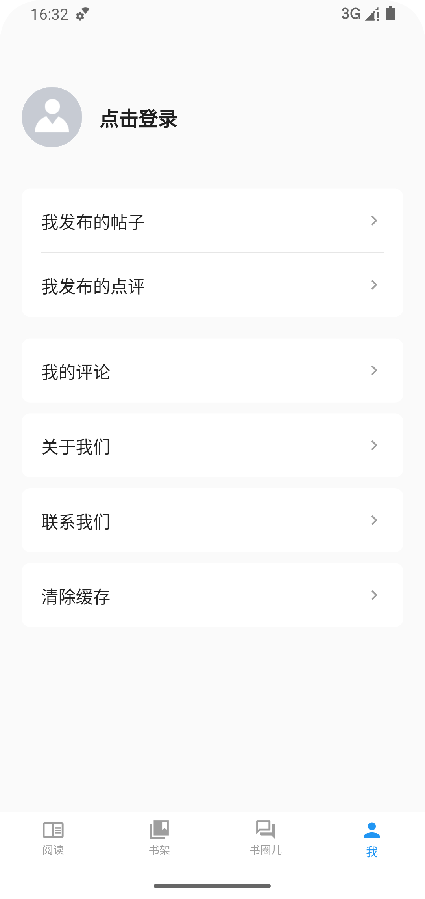

# 仿微信阅读APP

使用flutter 编写的多端应用，页面布局功能部分仿照微信阅读APP，代码开源仅供学习使用！
## Getting Started

This project is a starting point for a Flutter application.

A few resources to get you started if this is your first Flutter project:

- [Lab: Write your first Flutter app](https://docs.flutter.dev/get-started/codelab)
- [Cookbook: Useful Flutter samples](https://docs.flutter.dev/cookbook)

For help getting started with Flutter development, view the
[online documentation](https://docs.flutter.dev/), which offers tutorials,
samples, guidance on mobile development, and a full API reference.

## PC端体验地址
每日阅读PC端地址 : https://www.tititxt.net
## PC端开源代码：
flutter https://gitee.com/haojias/iread

## 数据接口
https://api.tititxt.net
> 如有需要请联系我申请 APP_ID 、SECRET_KEY

## 联系我
`qq：713347148`  
`email：haocjia@126.com`

## 展示图

